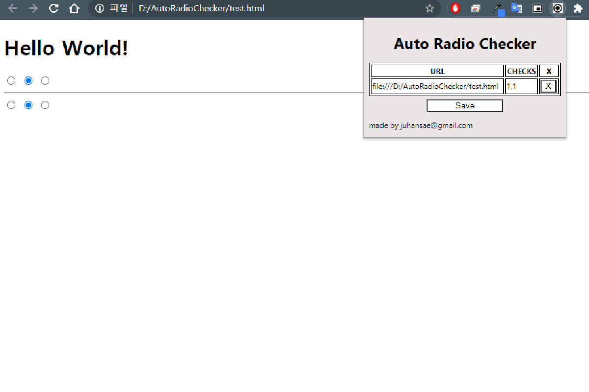

# Auto Radio Button Checker

[](https://chrome.google.com/webstore/detail/auto-radio-button-checker/phkflnpejpgehjgficbbikeclfcageic?hl=ko)
[](https://chrome.google.com/webstore/detail/auto-radio-button-checker/phkflnpejpgehjgficbbikeclfcageic?hl=ko)

A Chrome extension that automatically remembers and restores your radio button selections on web pages. No more repeatedly checking the same radio buttons every time you visit a page!

## 📸 Screenshot



*Clean, intuitive interface showing saved radio button selections*

## ✨ Features

- **🔄 Auto-Save**: Automatically saves your radio button selections
- **⚡ Auto-Restore**: Restores saved selections when you revisit pages
- **🌍 Multi-Language**: Supports English and Korean
- **🎨 Clean Design**: Modern, minimalist white theme interface
- **📱 User-Friendly**: Intuitive popup interface with clear indicators
- **🔒 Chrome Sync**: Data synced across your Chrome browsers via Google account
- **⚙️ Manifest V3**: Built with the latest Chrome extension standards

## 🚀 Installation

### From Chrome Web Store
1. Visit the [Chrome Web Store](https://chrome.google.com/webstore/detail/auto-radio-button-checker/phkflnpejpgehjgficbbikeclfcageic?hl=ko)
2. Click "Add to Chrome"
3. Pin the extension to your toolbar for easy access

### Manual Installation (Development)
1. Clone this repository
2. Open Chrome and go to `chrome://extensions/`
3. Enable "Developer mode"
4. Click "Load unpacked" and select the extension folder

## 📖 How to Use

1. **Navigate** to a webpage with radio buttons
2. **Select** the radio buttons you want to remember
3. **Click** the Auto Radio Button Checker extension icon
4. **Press** the "Save" button in the popup
5. **Done!** Your selections will be automatically restored on future visits

### Managing Saved Settings
- **View saved pages**: Open the extension popup to see all saved URLs
- **Delete settings**: Click the "X" button next to any URL to remove it
- **Update settings**: Simply make new selections and save again


## 🌍 Language Support

The extension automatically detects your browser language and supports:
- **English**: Full interface in English
- **Korean**: Complete Korean localization

## 💾 Data Storage & Sync

- **Chrome Storage Sync**: Uses Chrome's built-in sync storage for seamless experience across devices
- **Google Account Sync**: Your radio button settings automatically sync across all Chrome browsers signed in to your Google account
- **Storage Limit**: Up to 100KB total storage (approximately 500-1000 saved pages)
- **Data Format**: Stores URL patterns and radio button selection indices
- **Privacy**: Data is handled through Google's standard Chrome sync infrastructure

### File Structure
```
├── manifest.json          # Extension configuration
├── popup.html             # Extension popup interface
├── popup.js               # Popup logic and UI handling
├── popup.css              # Modern styling and themes
├── content_script.js      # Page interaction logic
├── icon.png              # Extension icon
├── _locales/             # Internationalization
│   ├── en/messages.json  # English translations
│   └── ko/messages.json  # Korean translations
└── README.md             # This file
```

## 📋 Version History

### Version 1.0 (Current) - Manifest V3 Update
- **🔄 Manifest V3 Migration**: Updated to the latest Chrome extension standard for enhanced security and performance
- **💻 Modern JavaScript**: Refactored codebase with async/await and modern ES6+ features  
- **🌍 Multi-Language Support**: Added English and Korean localization
- **🎨 Clean UI Design**: Redesigned with modern white theme interface

### Version 0.11
- URL comparison logic changed (equal → includes)
- Name change: Auto Radio Checker → Auto Radio Button Checker
- Improved Look and Feel


## 📄 License

This project is open source and available under the [MIT License](LICENSE).

## 🔗 Links

- [Chrome Web Store](https://chrome.google.com/webstore/detail/auto-radio-button-checker/phkflnpejpgehjgficbbikeclfcageic?hl=ko)
- [GitHub Repository](https://github.com/yourusername/AutoRadioButtonChecker)

## 💡 Tips

- **Pin the extension**: Add it to your Chrome toolbar for quick access
- **Regular cleanup**: Periodically remove unused saved settings
- **Chrome Sync**: Your settings sync across Chrome browsers signed in to your Google account
- **Compatibility**: Works with all standard HTML radio buttons